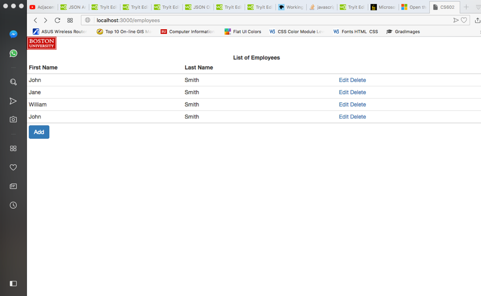
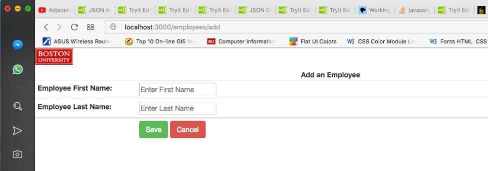
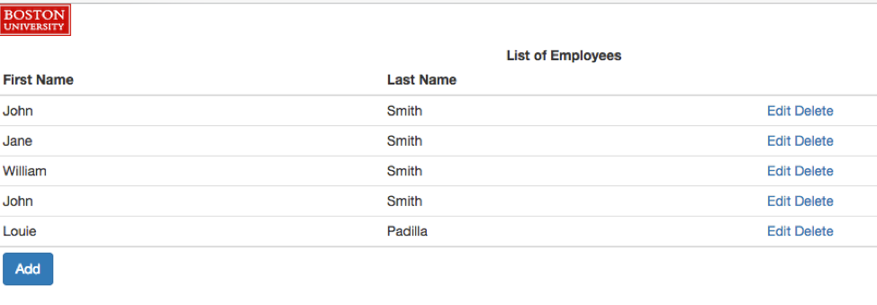
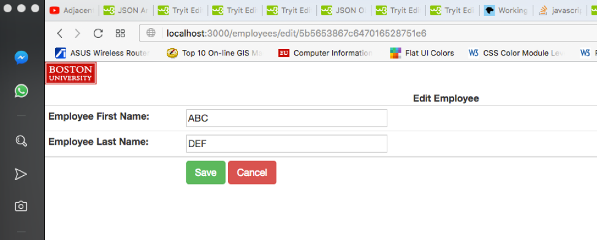
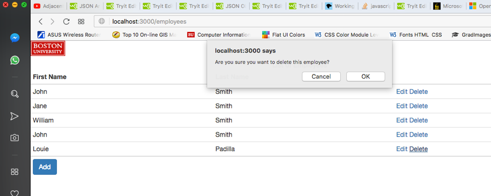
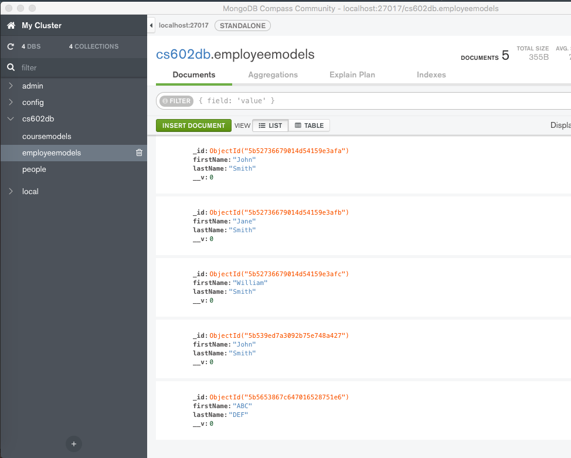

# employee-tracker

## About The Project

An application that tracks Employee Information. You can add, edit or delete any employee information.

## Built With
- MongoDB
- Mongoose library
- Handlebars for generating HTML templates 
- Node.js

## Usage
Adding an employee:

Editing an employee:

Deleting an employee:

MongoDB Sample: 

